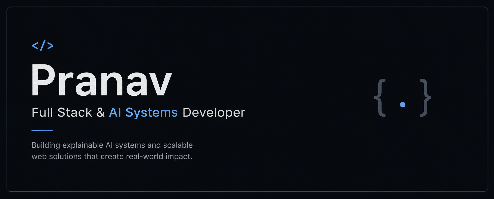

<div align="center">

[](https://git.io/typing-svg)



---

[](https://linkedin.com/in/pranav-pachn)
[](https://pranav-pachn.com)
[](pranavp2796@gmail.com)

</div>

```python
class AIEngineer:

    def __init__(self):
        self.name = "Pranav"
        self.role = "Full Stack & AI Systems Developer"

        self.specialization = {
            "AI": [
                "Explainable AI",
                "NLP Systems",
                "Decision Intelligence"
            ],

            "Engineering": [
                "Scalable Architectures",
                "Full Stack Systems",
                "Interactive Visualization"
            ]
        }

        self.interests = [
            "System Design",
            "AI Infrastructure",
            "Product Engineering"
        ]

        self.philosophy = "Engineering intelligent systems with real-world impact"
```

---

### ⚡ Current Focus
- **Explainable AI systems**
- **NLP-powered workflows**
- **Scalable backend architectures**
- **Intelligent scoring engines**
- **Interactive visualization platforms**

---

### 🧬 Engineering Philosophy
- **Explainable AI:** Developing systems where model decisions are transparent and actionable.
- **Scalable Architectures:** Designing modular, service-oriented backends capable of handling complex data flows.
- **Product-Focused:** Bridging the gap between deep technical engineering and intuitive user experiences.
- **Modern Performance:** Prioritizing latency, caching, and efficient resource utilization in every build.

---

### 🛠️ Technical Ecosystem

| | |
| :--- | :--- |
| **Frontend** |     |
| **Backend** |    |
| **AI / ML** |    |
| **Data/Ops** |     |
| **Languages** |     |

---

### 📊 System Analytics

<div align="center">
  <table border="0" cellspacing="0" cellpadding="0" style="width: 100%;">
    <tr>
      <td valign="top" width="50%">
        
      </td>
      <td valign="top" width="50%">
        
      </td>
    </tr>
  </table>

  <br/>

  
</div>

---

<div align="center">
  <sub>Designing intelligent systems with scalability, explainability, and real-world impact.</sub>
</div>
